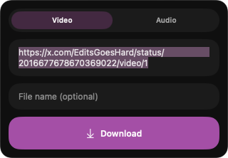
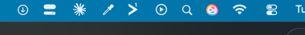

<div align="center">

# ⬇️ xsaver

### A native macOS menu bar app for saving videos and audio from X and Instagram

Paste a link, click once, and the video (or just its audio) lands in your Downloads.
It lives quietly in your menu bar and runs entirely on your own Mac.



</div>

---

## What it does

xsaver saves videos from **X** (formerly Twitter) and **Instagram reels** straight to
your Mac. Copy a post's link, open xsaver from your menu bar, paste it in, and hit
Download. You can grab the full video, or pull out just the audio.

It knows which link is which, so you do not pick anything. Paste an X link or an
Instagram link and it just works.

No website, no third-party downloader, no ads. Nothing else sees what you download.

## It lives in your menu bar

Click the little download icon at the top of your screen and a small panel drops down.
That is the whole app.

<p align="center">
  
</p>

## How to use it

1. **Copy** the link to any X post or Instagram reel that has a video.
2. **Click** the xsaver icon in your menu bar.
3. **Choose** Video or Audio, paste the link, and hit **Download**.

That's it. The panel shows the progress and tells you the moment it's saved. You can
also type your own file name, or leave it blank to keep the default.

### Instagram

Instagram only lets you download reels while you're signed in. The first time you grab
a reel, a small **Log in to Instagram** window appears. Sign in once and xsaver
remembers it, so after that reels download just like X videos.

## Where your files go

| You picked | It saves to | As |
| --- | --- | --- |
| **Video** | `Downloads / X downloads` | a video file (`.mp4`) |
| **Audio** | `Downloads / X-Audio` | an audio file (`.m4a`) |

Both folders are created for you automatically inside your Downloads.

## Run it on your Mac

xsaver is built with Xcode. To build it and start it up:

```sh
./build.sh
```

The icon appears in your menu bar. To have it launch automatically, add **xsaver.app**
to **System Settings → General → Login Items**.

---

<div align="center">
<sub>Runs entirely on your Mac. For saving your own clips and content.</sub>
</div>
